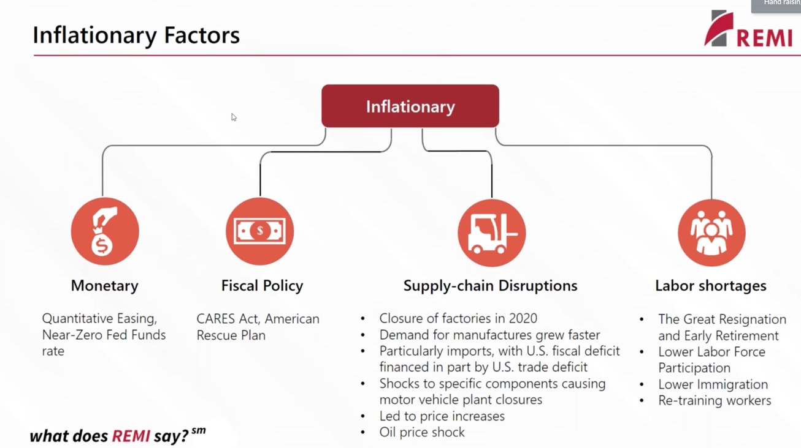
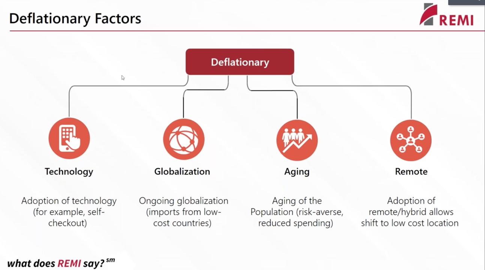
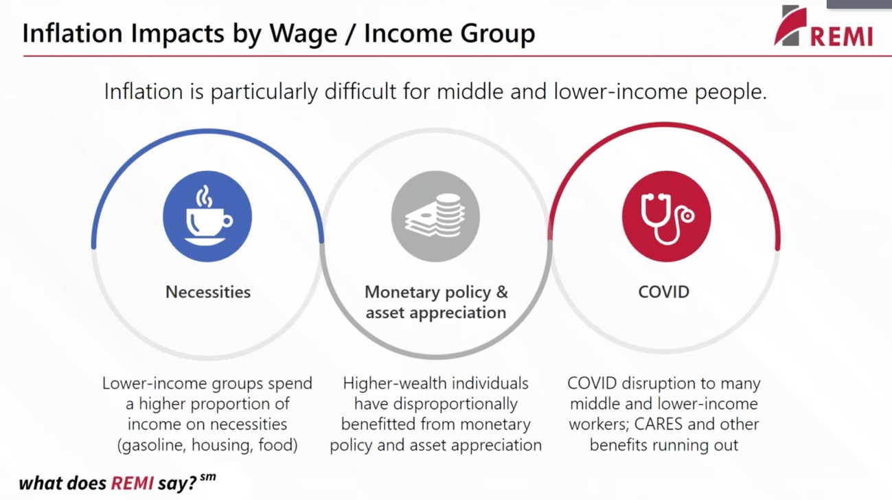
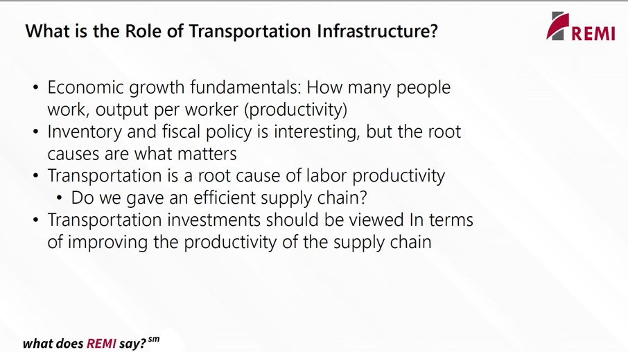
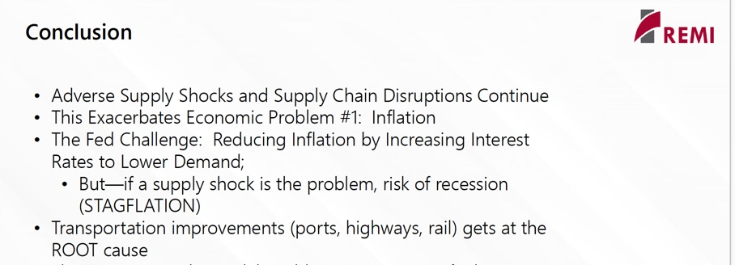

```{r setup, include=FALSE}
library(tufte)
# invalidate cache when the tufte version changes
knitr::opts_chunk$set(cache.extra = packageVersion('tufte'))
options(htmltools.dir.version = FALSE)
```
***

>I attended an interesting webinar last week that Fred Treyz, CEO of [REMI.com](https://remi.com), presented about inflation, transportation, and oil shocks. Although the entire webinar was informative and throught-provoking,^[All slides shown during the webinar and a video recording of the webinar are available at [the REMI.com web site](https://www.remi.com/event/transportation-inflation-and-the-supply-chain/)] I found that three slides encasulated components of inflationary and deflationary dynamics and their differential effects on various social and economic classes. Then, summarized on two slides are the results of exercises shared by Fred that simulated a 10% hike in the price of oil.

***


## **Dynamics of Inflation**

Various forces can increase or decrease consumer prices in complex ways.^[ *Monetary policy* is the process by which the government, central bank, or monetary authority manages the supply of money, or trading in foreign exchange markets. *Fiscal policy* attempts to influence the direction of the economy through changes in government spending or taxes. On top of these policies, we have experienced severe *supply-chain disruptions* and *labor shortages* that added to inflationary pressures.] 

^[*Technology* can make production more efficient. *Globalization* promotes trade with low-cost producers. *Aging* make different consumption choices. *Remote* work reduces costs of transportation and improves access to labor independent of geography.] 


^[Simply put, inflation degrades the well-being of lower income groups more than high-income/wealth groups. Lower income groups spend a high proportion of their wages on necessities that higher income groups, which have more cushion to buy higher priced necessities and discretionary consumption]

## **Role of Transportation in Inflation and Deflation**

Transportation is a major and direct driver of labor productivity. 
^[Transportation impediments have dented our supply chain significantly. Labor shortages amplify these transportation difficulties.] 

^[The possibility of *stagflation* is a worry. A period of slow economic growth and high unemployment (i.e., stagnation) can combine with rising prices (i.e., inflation) to create a recession(i.e., a business cycle contraction when there is a general decline in overall economic activity). ]

***

><span style="color:red;font-weight:900;font-size:16px">The five slides displayed in my notes are not mine; they--and the economic modeling behind them--are REMI's. Find more, detailed information in the webinar slides and recording. REMI is a leading provider of economic/demographic models that allow examination of "what if" questions pertinent to evaluation of alternatives to economic. transportation, and tax policy at local, regional, and national scales. *Disclosure:* I am not a shill for REMI. I was s satified and enthusiastic REMI customer since the early 1990s until I retired from Penn State in 2020.</span>

><span style="color:red;font-weight:400;font-size:15px"> ~dlp</span>

***
